# Deployment & Supabase Security Strategy - Technical Specification

> **Document Version:** 1.0  
> **Date:** 2026-01-28  
> **Status:** Draft - Awaiting User Approval  
> **Author:** ASISASE-SOTA Architect

---

## Table of Contents

1. [Executive Summary](#executive-summary)
2. [Deployment Options Analysis](#deployment-options-analysis)
3. [Supabase Security Architecture](#supabase-security-architecture)
4. [Database Schema Design](#database-schema-design)
5. [Implementation Roadmap](#implementation-roadmap)
6. [Security Best Practices](#security-best-practices)
7. [Appendices](#appendices)

---

## Executive Summary

This document provides a comprehensive technical specification for deploying the INSEE static website with Supabase integration. The analysis evaluates five deployment platforms, designs a secure Supabase architecture with Row Level Security (RLS), proposes optimized database schemas, and delivers a step-by-step implementation roadmap.

### Key Recommendations

| Category | Recommendation | Rationale |
|----------|---------------|-----------|
| **Primary Deployment** | **Cloudflare Pages** | Best balance of performance, security, edge network, and generous free tier |
| **Database** | **Supabase** | Already integrated, excellent RLS support, generous free tier |
| **Security** | **RLS + Environment Variables** | Defense-in-depth with no credentials in source code |
| **Authentication** | **Password-Based (Keep Current)** | Sufficient for secret dashboard use case |

---

## 1. Deployment Options Analysis

### 1.1 Platform Comparison Matrix

| Feature | Vercel | Netlify | Cloudflare Pages | GitHub Pages | Supabase Platform |
|---------|--------|---------|------------------|--------------|-------------------|
| **Free Tier Bandwidth** | 100 GB/month | 100 GB/month | Unlimited | 100 GB/month | 500 GB/month |
| **Build Minutes** | Unlimited | 500 min/month | Unlimited | N/A | N/A |
| **Custom Domains** | ✅ | ✅ | ✅ | ✅ | ✅ |
| **SSL/TLS** | Auto (Let's Encrypt) | Auto | Auto (Edge) | Auto (Let's Encrypt) | Auto |
| **Edge Network** | Global (80+ locations) | Global (200+ locations) | 300+ locations | GitHub CDN | Limited |
| **Environment Variables** | ✅ | ✅ | ✅ | ❌ | ✅ |
| **Preview Deployments** | ✅ | ✅ | ✅ | ✅ | ❌ |
| **Rollback** | ✅ | ✅ | ✅ | ❌ | ❌ |
| **Supabase Integration** | Excellent | Excellent | Good | Poor | Native |
| **Setup Complexity** | Low | Low | Low | Medium | Low |

### 1.2 Detailed Analysis

#### 1.2.1 Vercel

**Overview:** Vercel is the creator of Next.js and specializes in frontend deployments with excellent developer experience.

**Pros:**
- Seamless Supabase integration with built-in environment variable support
- Automatic HTTPS with custom domains
- Instant rollbacks and preview deployments
- Native support for static sites and serverless functions
- Excellent documentation and CLI tools

**Cons:**
- Bandwidth limit of 100 GB/month on free tier
- Analytics and other features require paid plans
- Limited to 6 collaborators on Pro plan

**Best For:** Teams already using or planning to use Next.js or Vercel ecosystem

**Security Score:** ⭐⭐⭐⭐⭐

---

#### 1.2.2 Netlify

**Overview:** Netlify pioneered modern static site hosting with a focus on developer workflow and automation.

**Pros:**
- Extensive form handling and identity management
- Build hooks and webhooks for CI/CD
- Netlify Identity for authentication (alternative to Supabase Auth)
- Atomic deploys with instant rollbacks
- Generous free tier with form submissions

**Cons:**
- Bandwidth limit of 100 GB/month on free tier
- Can get expensive for high-traffic sites
- Some features locked behind paid plans

**Best For:** Static sites requiring form handling or Netlify Identity

**Security Score:** ⭐⭐⭐⭐

---

#### 1.2.3 Cloudflare Pages ⭐ RECOMMENDED

**Overview:** Cloudflare Pages leverages Cloudflare's global edge network for unparalleled performance and security.

**Pros:**
- **Unlimited bandwidth** on free tier (game-changer for static sites)
- 300+ edge locations worldwide (best global coverage)
- Automatic Brotli compression and minification
- Native Cloudflare integration for security (DDoS protection, WAF)
- Environment variables fully supported
- Instant rollbacks and branch previews
- Excellent performance benchmarks

**Cons:**
- No serverless functions on free tier
- Smaller ecosystem compared to Vercel/Netlify
- Less mature developer tooling

**Best For:** High-traffic static sites prioritizing performance and unlimited bandwidth

**Security Score:** ⭐⭐⭐⭐⭐

---

#### 1.2.4 GitHub Pages

**Overview:** GitHub Pages hosts static content directly from GitHub repositories.

**Pros:**
- Free hosting with GitHub account
- Native integration with GitHub workflow
- Custom domains with SSL
- Jekyll support for static site generation

**Cons:**
- No environment variables support (credentials must be in source)
- Limited to static files only
- No built-in CI/CD (uses GitHub Actions)
- No preview deployments
- Slower performance compared to edge networks

**Best For:** Open-source projects where code transparency is valued

**Security Score:** ⭐⭐⭐ (Not recommended due to environment variable limitation)

---

#### 1.2.5 Supabase Platform

**Overview:** Supabase offers hosting alongside their database and auth services.

**Pros:**
- Native integration with Supabase database
- Edge Functions for serverless logic
- Built-in authentication and authorization
- Single dashboard for all services

**Cons:**
- Limited to 500 GB bandwidth on free tier
- Fewer edge locations compared to dedicated CDN
- More complex pricing model
- Newer platform with less mature tooling

**Best For:** Projects heavily using Supabase features

**Security Score:** ⭐⭐⭐⭐

---

### 1.3 Final Recommendation

```mermaid
graph TD
    A[Static Site Deployment] --> B{Bandwidth Needs?}
    B -->|High Traffic| C[Cloudflare Pages]
    B -->|Low Traffic| D{Supabase Integration?}
    D -->|Heavy Use| E[Supabase Platform]
    D -->|Light Use| F{Vercel vs Netlify}
    F -->|Preview Deployments| G[Vercel]
    F -->|Form Handling| H[Netlify]
    
    C1[✅ Unlimited Bandwidth<br/>✅ 300+ Edge Locations<br/>✅ Excellent Security]
    E1[✅ Native Integration<br/>✅ Edge Functions<br/>⚠️ Limited Bandwidth]
    G1[✅ Best DX<br/>✅ Preview Deployments<br/>⚠️ 100 GB Limit]
    H1[✅ Form Handling<br/>✅ Identity Built-in<br/>⚠️ 100 GB Limit]
```



**🥇 Primary Recommendation: Cloudflare Pages**

**Justification:**
1. **Unlimited bandwidth** eliminates cost concerns for static content
2. **Best-in-class edge network** ensures global performance
3. **Superior security features** including DDoS protection and WAF
4. **Environment variables** supported for secure credential management
5. **Free tier** is genuinely free with no hidden limitations

**Runner-up: Vercel** (if preview deployments and instant rollbacks are prioritized)

---

## 2. Supabase Security Architecture

### 2.1 Defense-in-Depth Strategy


### 2.2 Credentials Management Strategy

#### ❌ NEVER DO THIS (Current State - Insecure)

```javascript
// index.html - LINES 1428-1429 (CURRENT - INSECURE)
const supabaseUrl = 'https://your-project.supabase.co';  // HARDCODED
const supabaseKey = 'your-anon-key';  // HARDCODED - EXPOSED!
```

#### ✅ DO THIS (Recommended - Secure)

**Step 1: Create Environment Variables**

Create a `.env` file (add to `.gitignore`):

```env
# .env (NOT committed to version control)
PUBLIC_SUPABASE_URL=https://your-project.supabase.co
PUBLIC_SUPABASE_ANON_KEY=your-anon-key-here
```

**Step 2: Update Deployment Platform Configuration**

**For Cloudflare Pages:**
```
Settings → Environment Variables
Add:
- PUBLIC_SUPABASE_URL: https://your-project.supabase.co
- PUBLIC_SUPABASE_ANON_KEY: eyJhbGciOiJIUzI1NiIsInR5cCI6IkpXVCJ9...
```

**Step 3: Update JavaScript Code**

```javascript
// Updated Supabase configuration (SECURE)
const supabaseUrl = import.meta.env.PUBLIC_SUPABASE_URL;
const supabaseKey = import.meta.env.PUBLIC_SUPABASE_ANON_KEY;

// Validate environment variables are present
if (!supabaseUrl || !supabaseKey) {
    console.error('Supabase credentials not configured');
    // Graceful degradation - app continues without Supabase
}

// Initialize client
try {
    window.supabase = window.supabase.createClient(supabaseUrl, supabaseKey);
} catch (e) {
    console.warn('Supabase client initialization failed - running in offline mode');
}
```

### 2.3 Anon Key vs Service Role Key Usage

| Key Type | Purpose | Client-Side Access | RLS Bypass | When to Use |
|----------|---------|-------------------|------------|-------------|
| **Anon Key** | Public operations | ✅ YES | ❌ NO | Client-side CRUD with RLS |
| **Service Role Key** | Admin operations | ❌ NO | ✅ YES | Server-side/Edge Functions only |

**Critical Rules:**

1. **Never expose Service Role key client-side** - This bypasses all RLS
2. **Use Anon key for all client operations** - RLS enforces security
3. **Use Service Role key only in Edge Functions** - Server-side operations

```javascript
// WRONG - NEVER DO THIS
const serviceRoleKey = 'your-service-role-key';  // EXPOSED!

// CORRECT - Use Anon key only
const anonKey = 'your-anon-key';  // Safe for client-side
```

### 2.4 Row Level Security (RLS) Policies

#### 2.4.1 Logs Table RLS

```sql
-- Enable RLS on logs table
ALTER TABLE logs ENABLE ROW LEVEL SECURITY;

-- Create policy: Anyone with anon key can read logs (authenticated via app)
CREATE POLICY "Allow public read access" ON logs
    FOR SELECT
    USING (true);

-- Create policy: Anyone can insert logs (controlled by application logic)
CREATE POLICY "Allow public insert access" ON logs
    FOR INSERT
    WITH CHECK (true);

-- Create policy: Anyone can update their own logs (if user_id is present)
CREATE POLICY "Allow own log updates" ON logs
    FOR UPDATE
    USING (auth.uid() = user_id);

-- Create policy: Anyone can delete their own logs (if user_id is present)
CREATE POLICY "Allow own log deletions" ON logs
    FOR DELETE
    USING (auth.uid() = user_id);
```

#### 2.4.2 Metrics Table RLS

```sql
-- Enable RLS on metrics table
ALTER TABLE metrics ENABLE ROW LEVEL SECURITY;

-- Create policy: Anyone can read metrics (aggregated data is safe)
CREATE POLICY "Allow public read access" ON metrics
    FOR SELECT
    USING (true);

-- Create policy: Only service role can update metrics (via Edge Function)
CREATE POLICY "Service role only updates" ON metrics
    FOR ALL
    USING (false)
    WITH CHECK (false);
```

### 2.5 Edge Functions for Sensitive Operations

For operations requiring elevated permissions, use Supabase Edge Functions:

```typescript
// supabase/functions/update-metrics/index.ts
import { serve } from 'https://deno.land/std@0.168.0/http/server.ts'
import { createClient } from 'https://esm.sh/@supabase/supabase-js@2'

interface MetricsRequest {
    action: 'increment_weekly' | 'increment_daily' | 'update_score';
}

serve(async (req) => {
    // Verify service role key (only accessible server-side)
    const serviceRoleKey = Deno.env.get('SERVICE_ROLE_KEY')!;
    const supabase = createClient(
        Deno.env.get('SUPABASE_URL')!,
        serviceRoleKey
    );

    const { action }: MetricsRequest = await req.json();

    // Perform protected operations
    const { data, error } = await supabase.rpc('update_metrics', { 
        action_type: action 
    });

    if (error) {
        return new Response(JSON.stringify({ error }), { status: 400 });
    }

    return new Response(JSON.stringify({ success: true }), {
        headers: { 'Content-Type': 'application/json' }
    });
});
```

---

## 3. Database Schema Design

### 3.1 Current Schema (From docs/SecretDashboard.md)

```sql
CREATE TABLE logs (
    id uuid PRIMARY KEY DEFAULT gen_random_uuid(),
    created_at timestamptz DEFAULT now(),
    log_date date,
    log_time time,
    entry_id text,
    score numeric
);
```

### 3.2 Enhanced Schema Design

#### 3.2.1 Logs Table (Enhanced)

```sql
-- Drop existing table if migrating
DROP TABLE IF EXISTS logs CASCADE;

-- Create enhanced logs table
CREATE TABLE logs (
    id uuid PRIMARY KEY DEFAULT gen_random_uuid(),
    created_at timestamptz DEFAULT now(),
    updated_at timestamptz DEFAULT now(),
    
    -- Core data
    log_date date NOT NULL,
    log_time time NOT NULL,
    entry_id text NOT NULL,
    score numeric NOT NULL CHECK (score >= 0 AND score <= 100),
    
    -- Optional user tracking (for future authentication)
    user_id uuid REFERENCES auth.users(id) ON DELETE SET NULL,
    
    -- Metadata
    ip_address inet, -- For audit (not for RLS)
    user_agent text,
    
    -- Soft delete support
    deleted_at timestamptz
);

-- Indexes for performance
CREATE INDEX idx_logs_created_at ON logs(created_at DESC);
CREATE INDEX idx_logs_user_id ON logs(user_id);
CREATE INDEX idx_logs_date ON logs(log_date DESC);
CREATE INDEX idx_logs_score ON logs(score DESC);
```

#### 3.2.2 Metrics Table (New)

```sql
-- Drop existing table if migrating
DROP TABLE IF EXISTS metrics CASCADE;

-- Create metrics table for dashboard aggregations
CREATE TABLE metrics (
    id uuid PRIMARY KEY DEFAULT gen_random_uuid(),
    created_at timestamptz DEFAULT now(),
    updated_at timestamptz DEFAULT now(),
    
    -- Weekly aggregation
    weekly_entries integer DEFAULT 0,
    weekly_avg_score numeric DEFAULT 0,
    weekly_start_date date,
    
    -- Daily aggregation
    daily_entries integer DEFAULT 0,
    daily_avg_score numeric DEFAULT 0,
    daily_date date,
    
    -- Overall stats
    total_entries bigint DEFAULT 0,
    overall_avg_score numeric DEFAULT 0,
    
    -- Metadata
    last_log_id uuid REFERENCES logs(id)
);

-- Create singleton metrics record
INSERT INTO metrics (id, weekly_start_date, daily_date)
VALUES ('00000000-0000-0000-0000-000000000001', CURRENT_DATE, CURRENT_DATE)
ON CONFLICT (id) DO NOTHING;
```

#### 3.2.3 Database Functions (Auto-Update Metrics)

```sql
-- Function to update metrics automatically
CREATE OR REPLACE FUNCTION update_metrics()
RETURNS TRIGGER AS $$
BEGIN
    -- Update weekly metrics
    UPDATE metrics SET
        weekly_entries = (
            SELECT COUNT(*) FROM logs 
            WHERE created_at >= CURRENT_DATE - INTERVAL '7 days'
        ),
        weekly_avg_score = (
            SELECT AVG(score) FROM logs 
            WHERE created_at >= CURRENT_DATE - INTERVAL '7 days'
        ),
        weekly_start_date = DATE_TRUNC('week', CURRENT_DATE),
        updated_at = now()
        WHERE id = '00000000-0000-0000-0000-000000000001';
    
    -- Update daily metrics
    UPDATE metrics SET
        daily_entries = (
            SELECT COUNT(*) FROM logs 
            WHERE DATE(created_at) = CURRENT_DATE
        ),
        daily_avg_score = (
            SELECT AVG(score) FROM logs 
            WHERE DATE(created_at) = CURRENT_DATE
        ),
        daily_date = CURRENT_DATE,
        updated_at = now()
        WHERE id = '00000000-0000-0000-0000-000000000001';
    
    -- Update overall stats
    UPDATE metrics SET
        total_entries = (SELECT COUNT(*) FROM logs),
        overall_avg_score = (SELECT AVG(score) FROM logs),
        last_log_id = NEW.id,
        updated_at = now()
        WHERE id = '00000000-0000-0000-0000-000000000001';
    
    RETURN NEW;
END;
$$ LANGUAGE plpgsql SECURITY DEFINER;

-- Trigger to auto-update metrics on log insert
CREATE TRIGGER on_log_insert
    AFTER INSERT ON logs
    FOR EACH ROW
    EXECUTE FUNCTION update_metrics();
```

### 3.3 Entity Relationship Diagram


### 3.4 RLS Policy Summary

```sql
-- Verify RLS is enabled
SELECT tablename, rowsecurity FROM pg_tables 
WHERE schemaname = 'public' AND tablename IN ('logs', 'metrics');

-- List all policies
SELECT * FROM pg_policies WHERE tablename IN ('logs', 'metrics');
```

---

## 4. Implementation Roadmap

### Phase 1: Supabase Project Setup (Day 1)

#### 4.1.1 Create Supabase Project

1. Navigate to [supabase.com](https://supabase.com)
2. Sign up/Login with GitHub or email
3. Click "New Project"
4. Configure:
   - **Name:** `insee-dashboard`
   - **Database Password:** Generate strong password (save securely)
   - **Region:** Choose closest to your users (e.g., `eu-west-1` for Europe)
5. Wait for project initialization (~2 minutes)

#### 4.1.2 Run Database Schema

Execute in Supabase SQL Editor:

```sql
-- Enable UUID extension
CREATE EXTENSION IF NOT EXISTS "uuid-ossp";

-- Create logs table
CREATE TABLE logs (
    id uuid PRIMARY KEY DEFAULT gen_random_uuid(),
    created_at timestamptz DEFAULT now(),
    updated_at timestamptz DEFAULT now(),
    log_date date NOT NULL,
    log_time time NOT NULL,
    entry_id text NOT NULL,
    score numeric NOT NULL CHECK (score >= 0 AND score <= 100),
    user_id uuid REFERENCES auth.users(id) ON DELETE SET NULL,
    ip_address inet,
    user_agent text,
    deleted_at timestamptz
);

-- Create indexes
CREATE INDEX idx_logs_created_at ON logs(created_at DESC);
CREATE INDEX idx_logs_user_id ON logs(user_id);
CREATE INDEX idx_logs_date ON logs(log_date DESC);
CREATE INDEX idx_logs_score ON logs(score DESC);

-- Enable RLS
ALTER TABLE logs ENABLE ROW LEVEL SECURITY;

-- RLS Policies
CREATE POLICY "Allow public read" ON logs FOR SELECT USING (true);
CREATE POLICY "Allow public insert" ON logs FOR INSERT WITH CHECK (true);
CREATE POLICY "Allow public delete" ON logs FOR DELETE USING (true);
CREATE POLICY "Allow public update" ON logs FOR UPDATE USING (true);

-- Create metrics table
CREATE TABLE metrics (
    id uuid PRIMARY KEY DEFAULT gen_random_uuid(),
    created_at timestamptz DEFAULT now(),
    updated_at timestamptz DEFAULT now(),
    weekly_entries integer DEFAULT 0,
    weekly_avg_score numeric DEFAULT 0,
    weekly_start_date date,
    daily_entries integer DEFAULT 0,
    daily_avg_score numeric DEFAULT 0,
    daily_date date,
    total_entries bigint DEFAULT 0,
    overall_avg_score numeric DEFAULT 0,
    last_log_id uuid
);

-- Initialize metrics record
INSERT INTO metrics (id, weekly_start_date, daily_date)
VALUES ('00000000-0000-0000-0000-000000000001', CURRENT_DATE, CURRENT_DATE)
ON CONFLICT (id) DO NOTHING;

-- Enable RLS on metrics
ALTER TABLE metrics ENABLE ROW LEVEL SECURITY;
CREATE POLICY "Allow public read" ON metrics FOR SELECT USING (true);
CREATE POLICY "Service role only" ON metrics FOR ALL USING (false) WITH CHECK (false);

-- Create auto-update function
CREATE OR REPLACE FUNCTION update_metrics()
RETURNS TRIGGER AS $$
BEGIN
    UPDATE metrics SET
        weekly_entries = (SELECT COUNT(*) FROM logs WHERE created_at >= CURRENT_DATE - INTERVAL '7 days'),
        weekly_avg_score = (SELECT AVG(score) FROM logs WHERE created_at >= CURRENT_DATE - INTERVAL '7 days'),
        weekly_start_date = DATE_TRUNC('week', CURRENT_DATE),
        updated_at = now()
        WHERE id = '00000000-0000-0000-0000-000000000001';
    
    UPDATE metrics SET
        daily_entries = (SELECT COUNT(*) FROM logs WHERE DATE(created_at) = CURRENT_DATE),
        daily_avg_score = (SELECT AVG(score) FROM logs WHERE DATE(created_at) = CURRENT_DATE),
        daily_date = CURRENT_DATE,
        updated_at = now()
        WHERE id = '00000000-0000-0000-0000-000000000001';
    
    UPDATE metrics SET
        total_entries = (SELECT COUNT(*) FROM logs),
        overall_avg_score = (SELECT AVG(score) FROM logs),
        last_log_id = NEW.id,
        updated_at = now()
        WHERE id = '00000000-0000-0000-0000-000000000001';
    
    RETURN NEW;
END;
$$ LANGUAGE plpgsql SECURITY DEFINER;

-- Create trigger
CREATE TRIGGER on_log_insert
    AFTER INSERT ON logs
    FOR EACH ROW
    EXECUTE FUNCTION update_metrics();
```

#### 4.1.3 Get API Credentials

1. Go to **Settings → API**
2. Copy:
   - **Project URL:** `https://your-project.supabase.co`
   - **anon public key:** `eyJhbGciOiJIUzI1NiIsInR5cCI6IkpXVCJ9...`

### Phase 2: Environment Variables Setup (Day 1)

#### 4.2.1 Create Local Environment File

Create `.env` file in project root:

```env
# .env - ADD TO .gitignore!
PUBLIC_SUPABASE_URL=https://your-project.supabase.co
PUBLIC_SUPABASE_ANON_KEY=your-anon-key-here
```

Add to `.gitignore`:

```
# .gitignore
.env
.env.local
.env.*.local
```

#### 4.2.2 Cloudflare Pages Configuration

1. Navigate to [dash.cloudflare.com](https://dash.cloudflare.com)
2. Select "Pages" → "Connect to Git"
3. Select your repository
4. Configure build settings:
   - **Build command:** (leave empty for static site)
   - **Build output directory:** `/`
5. Add environment variables:
   - `PUBLIC_SUPABASE_URL`: Your Supabase project URL
   - `PUBLIC_SUPABASE_ANON_KEY`: Your anon key
6. Click "Deploy site"

### Phase 3: Frontend Code Updates (Day 2)

#### 4.3.1 Update index.html

**BEFORE (Lines 1428-1436):**

```javascript
const supabaseUrl = 'https://your-project.supabase.co';
const supabaseKey = 'your-anon-key';

try {
    window.supabase = window.supabase.createClient(supabaseUrl, supabaseKey);
} catch (e) {
    console.warn('Supabase client initialization failed - running in offline mode');
}
```

**AFTER:**

```javascript
// Supabase configuration - credentials loaded from environment variables
// This file is processed at build time by Vite/Webpack
const supabaseUrl = import.meta.env.PUBLIC_SUPABASE_URL;
const supabaseKey = import.meta.env.PUBLIC_SUPABASE_ANON_KEY;

// Validate configuration
if (!supabaseUrl || !supabaseKey) {
    console.warn('Supabase credentials not configured - running in offline mode');
    window.supabase = null;
} else {
    try {
        window.supabase = window.supabase.createClient(supabaseUrl, supabaseKey);
    } catch (e) {
        console.warn('Supabase client initialization failed - running in offline mode');
        window.supabase = null;
    }
}
```

#### 4.3.2 Add Offline Fallback Enhancement

Update the existing offline handling in [`index.html`](index.html:1438-1443):

```javascript
// Enhanced session state with offline support
let isLoggedIn = false;
let clickCount = 0;
let rateInterval = null;
let secondsElapsed = 0;
let offlineMode = !window.supabase;

// Supabase availability check
const isSupabaseAvailable = () => {
    return window.supabase !== null;
};
```

### Phase 4: Deploy and Test (Day 2-3)

#### 4.4.1 Pre-Deployment Checklist

- [ ] All credentials removed from source code
- [ ] Environment variables configured locally
- [ ] `.env` added to `.gitignore`
- [ ] Cloudflare Pages connected to repository
- [ ] Environment variables added to Cloudflare
- [ ] Database tables created in Supabase
- [ ] RLS policies enabled
- [ ] All existing functionality tested locally

#### 4.4.2 Deployment Steps

**Cloudflare Pages:**
```bash
# Option 1: Manual upload
1. Zip build output
2. Go to dash.cloudflare.com → Pages
3. Upload zip file

# Option 2: Git integration (recommended)
1. Push changes to GitHub
2. Cloudflare auto-deploys on push
```

#### 4.4.3 Post-Deployment Testing

```javascript
// Test in browser console
console.log('Supabase URL:', supabaseUrl);
console.log('Supabase Client:', window.supabase);

// Test connection
async function testConnection() {
    if (!window.supabase) {
        console.log('Offline mode active');
        return;
    }
    
    try {
        const { data, error } = await window.supabase
            .from('logs')
            .select('count', { count: 'exact', head: true });
        
        if (error) {
            console.error('Supabase connection failed:', error);
        } else {
            console.log('Supabase connected successfully. Log count:', data[0].count);
        }
    } catch (e) {
        console.error('Supabase error:', e);
    }
}

testConnection();
```

### Phase 5: Security Audit (Day 3)

#### 4.5.1 Verify RLS Policies

```sql
-- Run in Supabase SQL Editor
SELECT 
    tablename,
    policyname,
    cmd,
    roles,
    qual,
    with_check
FROM pg_policies
WHERE schemaname = 'public';
```

#### 4.5.2 Verify No Hardcoded Credentials

Search for patterns in codebase:

```bash
# Check for exposed credentials
grep -r "supabase" --include="*.html" --include="*.js" | grep -v "import.meta.env"
```

#### 4.5.3 Test Attack Scenarios

| Test | Expected Result |
|------|----------------|
| Direct database URL access | Blocked by RLS |
| Anonymous insert | Allowed (controlled by app) |
| Delete without auth | Blocked (if user_id required) |
| Rate limiting | Enforced by Supabase |

---

## 5. Security Best Practices

### 5.1 Environment Variables Security


**Important:** Environment variables prefixed with `PUBLIC_` are accessible in client-side code. Never use non-prefixed variables for secrets you want to keep private.

### 5.2 Input Validation

```javascript
// Validate log input before sending to Supabase
async function addLog(logData) {
    // Input validation
    if (!logData.entry_id || typeof logData.entry_id !== 'string') {
        throw new Error('Invalid entry_id');
    }
    
    if (typeof logData.score !== 'number' || logData.score < 0 || logData.score > 100) {
        throw new Error('Invalid score: must be 0-100');
    }
    
    const logEntry = {
        log_date: new Date().toISOString().split('T')[0],
        log_time: new Date().toTimeString().split(' ')[0],
        entry_id: logData.entry_id.trim(),
        score: Math.round(logData.score * 10) / 10, // Round to 1 decimal
        created_at: new Date().toISOString()
    };
    
    // Save to Supabase if available
    if (window.supabase) {
        const { data, error } = await window.supabase
            .from('logs')
            .insert([logEntry]);
        
        if (error) {
            console.error('Supabase insert error:', error);
            throw error;
        }
    }
    
    return logEntry;
}
```

### 5.3 Rate Limiting (Supabase Side)

```sql
-- Create function to check rate limits
CREATE OR REPLACE FUNCTION check_rate_limit(
    user_ip inet,
    limit_count integer DEFAULT 10,
    window_minutes integer DEFAULT 1
)
RETURNS boolean AS $$
DECLARE
    recent_count integer;
BEGIN
    SELECT COUNT(*) INTO recent_count
    FROM logs
    WHERE ip_address = user_ip
    AND created_at > NOW() - (window_minutes || ' minutes')::interval;
    
    RETURN recent_count < limit_count;
END;
$$ LANGUAGE plpgsql SECURITY DEFINER;

-- Apply rate limit to insert
CREATE POLICY "Rate limited insert" ON logs
    FOR INSERT
    WITH CHECK (check_rate_limit(ip_address));
```

### 5.4 Audit Logging

```sql
-- Create audit log table
CREATE TABLE audit_logs (
    id uuid PRIMARY KEY DEFAULT gen_random_uuid(),
    created_at timestamptz DEFAULT now(),
    table_name text NOT NULL,
    operation text NOT NULL,
    record_id uuid,
    user_id uuid,
    ip_address inet,
    old_data jsonb,
    new_data jsonb
);

-- Trigger for audit logging
CREATE OR REPLACE FUNCTION log_audit()
RETURNS TRIGGER AS $$
BEGIN
    INSERT INTO audit_logs (table_name, operation, record_id, user_id, ip_address, old_data, new_data)
    VALUES (
        TG_TABLE_NAME,
        TG_OP,
        COALESCE(NEW.id, OLD.id),
        COALESCE(NEW.user_id, OLD.user_id),
        COALESCE(NEW.ip_address, OLD.ip_address),
        CASE WHEN TG_OP = 'DELETE' THEN to_jsonb(OLD) ELSE NULL END,
        CASE WHEN TG_OP IN ('INSERT', 'UPDATE') THEN to_jsonb(NEW) ELSE NULL END
    );
    RETURN NULL;
END;
$$ LANGUAGE plpgsql;

CREATE TRIGGER audit_logs_trigger
    AFTER INSERT OR UPDATE OR DELETE ON logs
    FOR EACH ROW EXECUTE FUNCTION log_audit();
```

---

## 6. Appendices

### Appendix A: Quick Reference - Environment Variables

| Variable | Purpose | Where to Set |
|----------|---------|--------------|
| `PUBLIC_SUPABASE_URL` | Supabase project URL | Cloudflare Pages, Vercel, Netlify |
| `PUBLIC_SUPABASE_ANON_KEY` | Public API key | Cloudflare Pages, Vercel, Netlify |
| `SERVICE_ROLE_KEY` | Admin API key (server-only) | Supabase Edge Functions env |

### Appendix B: Troubleshooting Guide

| Issue | Solution |
|-------|----------|
| "Supabase client initialization failed" | Check environment variables are set and valid |
| "RLS policy denied" | Verify RLS policies are enabled and correct |
| CORS errors | Add deployment domain to Supabase allowed origins |
| Rate limited | Implement exponential backoff in client |
| Data not syncing | Check offline mode status and retry logic |

### Appendix C: Recommended Tools

| Tool | Purpose | Link |
|------|---------|------|
| Supabase CLI | Local development, migrations | https://github.com/supabase/cli |
| pgAdmin | Database GUI management | https://www.pgadmin.org |
| Cloudflare Pages CLI | Local preview | https://github.com/cloudflare/pages/tree/main/packages/cli |
| GitHub Secrets | Secure credential storage | Repository → Settings → Secrets |

### Appendix D: Cost Analysis (Monthly)

| Service | Free Tier | Cost if Exceeded |
|---------|-----------|------------------|
| Cloudflare Pages | Unlimited | $0 |
| Supabase | 500 MB DB, 50K MAU | $25/month for next tier |
| Domain (optional) | - | $12-15/year |

**Total Monthly Cost (Production):** $0 (within free tiers)

---

## Document Approval

| Role | Name | Date | Signature |
|------|------|------|-----------|
| Architect | ASISASE-SOTA | 2026-01-28 | ⏳ Pending |
| User | | | ⏳ Pending |

---

*This document is part of the ASISASE-SOTA technical documentation suite. For questions or updates, contact the Architecture team.*
